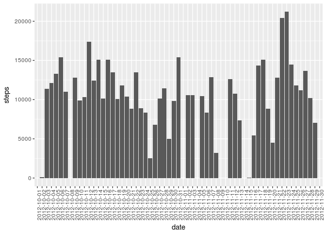
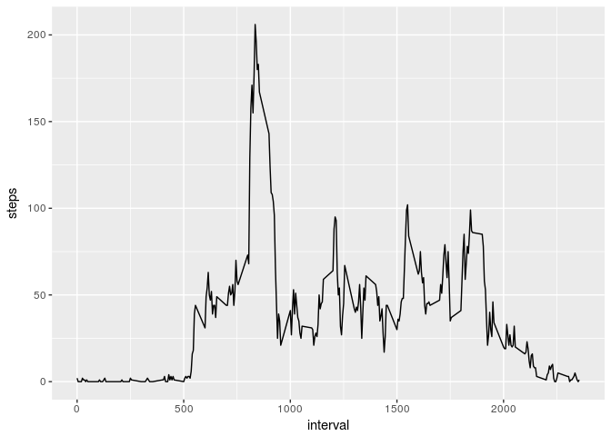
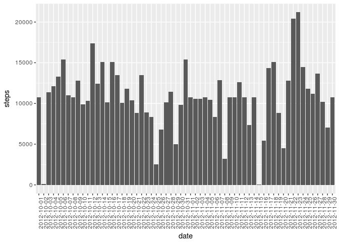
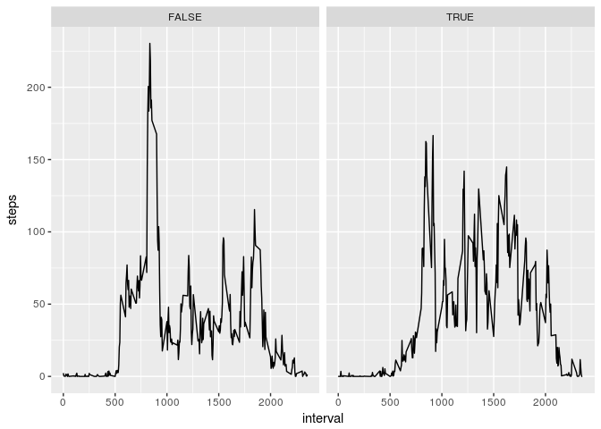

# Reproducible Research: Peer Assessment 1
## Setup

```r
library(lubridate)
library(ggplot2)
library(dplyr)
```
## Loading and preprocessing the data

```r
activity <- read.csv("activity.csv",stringsAsFactors = F)
head(activity)
```

```
##   steps       date interval
## 1    NA 2012-10-01        0
## 2    NA 2012-10-01        5
## 3    NA 2012-10-01       10
## 4    NA 2012-10-01       15
## 5    NA 2012-10-01       20
## 6    NA 2012-10-01       25
```
## What is mean total number of steps taken per day?

```r
stepsperday <- group_by(activity,date) %>% summarise(steps = sum(steps,na.rm=T))
ggplot(stepsperday,aes(x=date,y=steps)) + geom_col() + theme(axis.text.x = element_text(angle = 90))
```

<!-- -->

* the average steps per day

```r
mean(stepsperday$steps)
```

```
## [1] 9354.23
```
* the median steps per day

```r
median(stepsperday$steps)
```

```
## [1] 10395
```
## What is the average daily activity pattern?

```r
# avgsp = average steps per interval of days
avgspi <- group_by(activity,interval) %>% summarise(steps = round(mean(steps,na.rm =T )))
head(avgspi)
```

```
## # A tibble: 6 x 2
##   interval steps
##      <int> <dbl>
## 1        0     2
## 2        5     0
## 3       10     0
## 4       15     0
## 5       20     0
## 6       25     2
```

```r
ggplot(avgspi,aes(interval,steps)) + geom_line()
```

<!-- -->

```r
filter(avgspi,steps == max(steps))
```

```
## # A tibble: 1 x 2
##   interval steps
##      <int> <dbl>
## 1      835   206
```
## Imputing missing values
-  the total number of rows with 𝙽𝙰s

```r
sum(is.na(activity$steps))
```

```
## [1] 2304
```
- fill NAs with the average steps of each interval in all days

```r
fillNAs <- function(){
  interval <- avgspi$interval
  for( i in interval){
    activity[(activity$interval == i) & is.na(activity$steps),]$steps <- avgspi[avgspi$interval == i,]$steps
  }
  return(activity)
}
activity <- fillNAs()
head(activity)
```

```
##   steps       date interval
## 1     2 2012-10-01        0
## 2     0 2012-10-01        5
## 3     0 2012-10-01       10
## 4     0 2012-10-01       15
## 5     0 2012-10-01       20
## 6     2 2012-10-01       25
```

- plot steps of each day

```r
stepsperday <- group_by(activity,date) %>% summarise(steps = sum(steps,na.rm=T))
ggplot(stepsperday,aes(x=date,y=steps)) + geom_col() + theme(axis.text.x = element_text(angle = 90))
```

<!-- -->

## Are there differences in activity patterns between weekdays and weekends?

**TRUE is represent weekends!**

```r
is.weekend<- function(d){
  wday(d) %in% c(1,7)
}
activity$weekend <- is.weekend(activity$date)
nactivity <- select(activity,-date)
weekdata <- group_by(nactivity,interval,weekend) %>% summarise(steps = mean(steps))
ggplot(weekdata,aes(x=interval,y=steps)) + geom_line() + facet_wrap(~ weekend)
```

<!-- -->

```r
#stepsperday <- group_by(activity,date) %>% summarise(steps = sum(steps,na.rm=T))
#ggplot(stepsperday,aes(x=date,y=steps,color=is.weekend(date))) + geom_col() + theme(axis.text.x = element_text(angle = 90))
```

